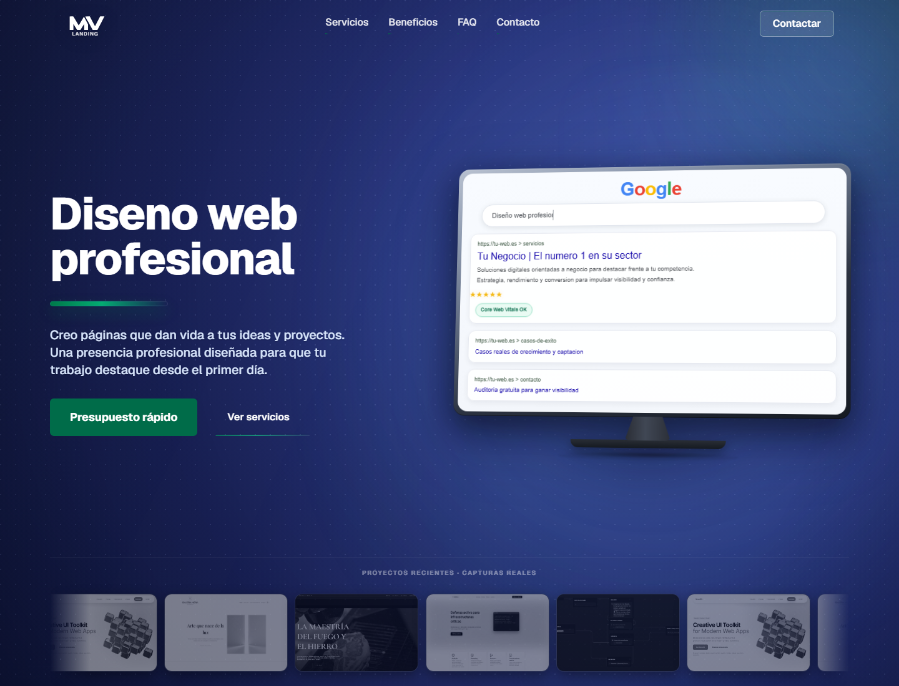

# Landing Comercial

Landing page independiente para ofrecer servicios de diseno web profesional. Esta version esta separada del portfolio principal y preparada para desplegarse en cualquier dominio, subdominio o instalacion aislada.



## Que incluye

- Landing completa en SvelteKit con ruta principal en `/diseno-web`.
- Hero comercial, secciones de servicios, beneficios, mantenimiento, FAQ y llamada final a contacto.
- Formulario de contacto y enlace a WhatsApp mediante endpoints internos.
- Analizador PageSpeed integrado para captar leads desde auditorias web.
- Datos por defecto locales, sin depender del portfolio original.
- Assets incluidos en `static/` para poder mover el proyecto sin arrastrar contenido extra.

## Stack

- SvelteKit
- Svelte 5
- Vite
- TypeScript
- CSS propio con fuentes Geist

## Primer arranque

```bash
pnpm install
pnpm run dev
```

La app queda disponible en:

```txt
http://localhost:5173/diseno-web
```

La ruta `/` redirige automaticamente a `/diseno-web`.

## Produccion

```bash
pnpm run check
pnpm run build
pnpm run preview
```

## Configuracion

Copia `.env.example` a `.env` y ajusta las variables necesarias para tu despliegue.

```bash
cp .env.example .env
```

## Uso previsto

Este repo funciona como una landing comercial autonoma: se puede publicar tal cual, adaptar el copy, cambiar el dominio o usar como base para campanas independientes sin mezclarlo con el portfolio personal.
